# 🎮 Hub de Jogos Nexus (PS1 & PS2)

> Uma plataforma que reúne de forma simples jogos antigos de ps1 e ps2, onde você pode baixar e jogá-los!

---

## 📸 Demonstração

## ✨ Funcionalidades
* **Interface Intuitiva:** Navegue pelos seus jogos com capas e descrições.
* **Integração com Emuladores:** Lança automaticamente o **PCSX2** e o **DuckStation**.
*  **Integração com site:** Para o download dos jogos, é integrado com o site **ROMSFUN**.
* **Portabilidade:** Sem a necessidade de configuração avançada para jogar os jogos, além de a possibilidade de navegar no app via controle.

## 🚀 Como Rodar o Projeto

### 1. Pré-requisitos
Se você não tiver o node.js instalado na sua máquina, baixe para não ocorrer nenhum erro no programa
* [Node.js](https://nodejs.org/) 

### 2. Instalação
Link para o google drive do projeto:
* [Nexus](https://drive.google.com/drive/folders/1QDXbtMueZnKhdbve6xSs31lpFFki-G5b?usp=drive_link) 

---

## ✨ Funcionamento e Execução

Diferente de aplicativos convencionais que utilizam um instalador (build final), este projeto foi estruturado para rodar de forma **portátil**. 

### ⚙️ Por que não existe um instalador (`.exe`)?
O site utilizado como fonte dos jogos (**romsfun.com**) possui restrições de segurança que bloqueiam requisições vindas de aplicativos compilados. Para contornar essa limitação e manter a simplicidade do projeto, optei pela **execução direta**, ou seja, no terminal powershell. Isso garante que os downloads de arquivos `.iso` e `.chd` funcionem sem interrupções.

### 🚀 Como rodar o Nexus Hub
1. **Baixe e extraia** o arquivo ZIP do projeto.
2. Acesse a pasta extraída (chamada `web_content`).
3. Localize e execute o arquivo **`nexus.bat`**. Se preferir, envie um atalho desse arquivo para a área de trabalho, para facilitar o acesso. Tenha em mente que o arquivo nexus.bat seria como um arquivo .exe de um programa convencional.

> **Nota:** O arquivo `.bat` automatiza a inicialização do ambiente, executando o comando `npx electron .` de forma invisível para que você não precise usar o terminal manualmente.

### 🎮 Sobre os Emuladores (DuckStation e PCSX2)
Ao abrir um jogo pela primeira vez, os emuladores integrados solicitarão uma configuração inicial rápida.
Lembrando que é necessário fazer isso apenas uma vez!

#### ETAPAS PARA O EMULADOR DE PS1:

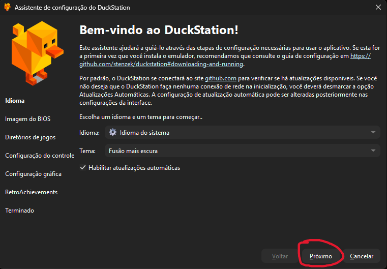

&nbsp;

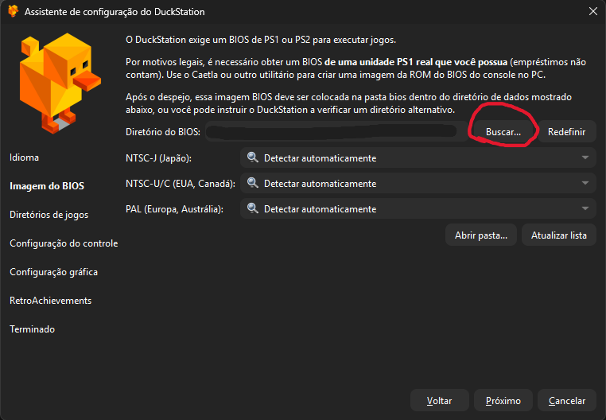

&nbsp;

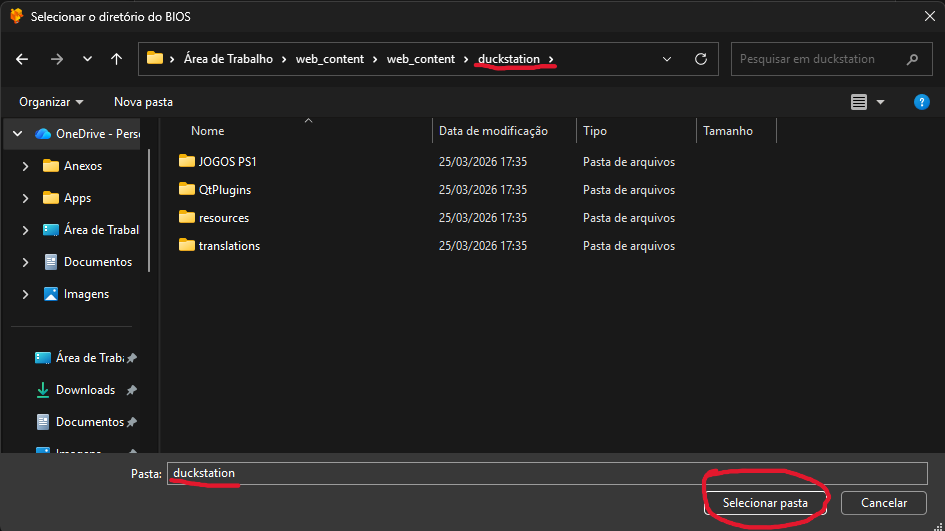
&nbsp;

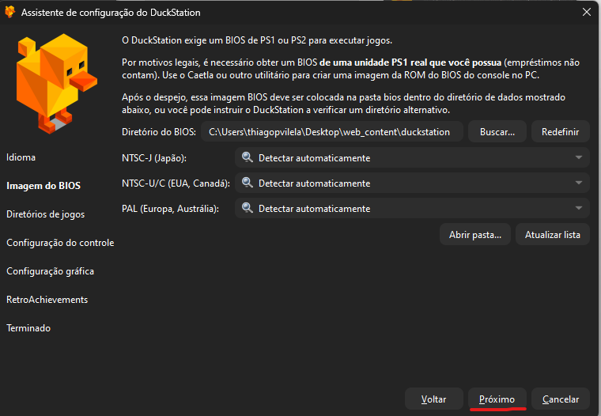
&nbsp;
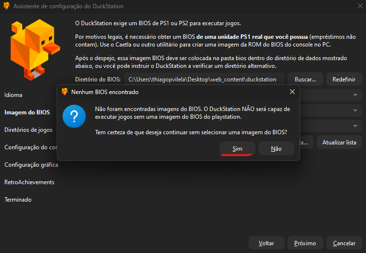
&nbsp;
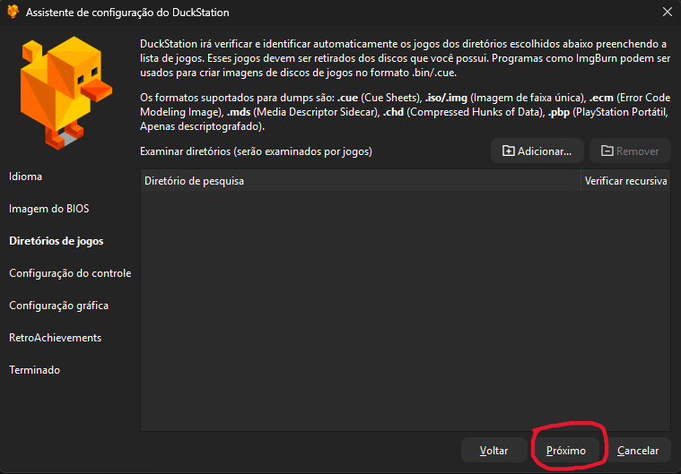
&nbsp;
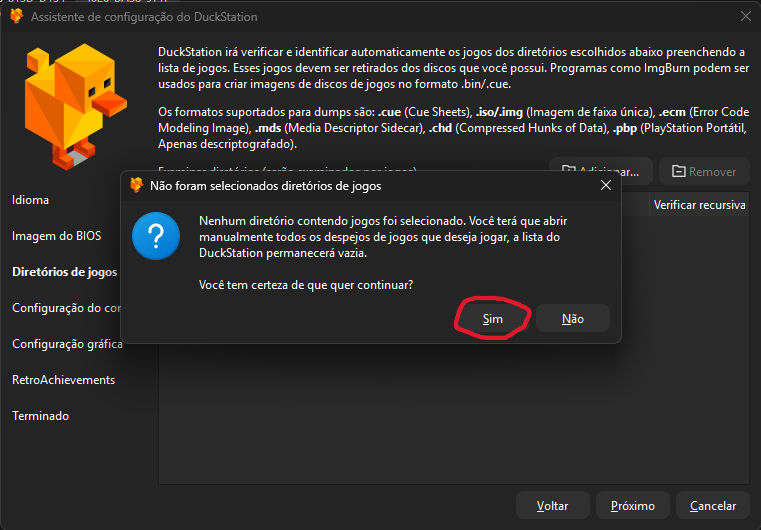
&nbsp;
### Aqui você deve conectar o controle, ir no mapeamento automático e procurar o controle, se você estiver usando 2 controles, faça a mesma coisa para o mapeamento de baixo.
&nbsp;

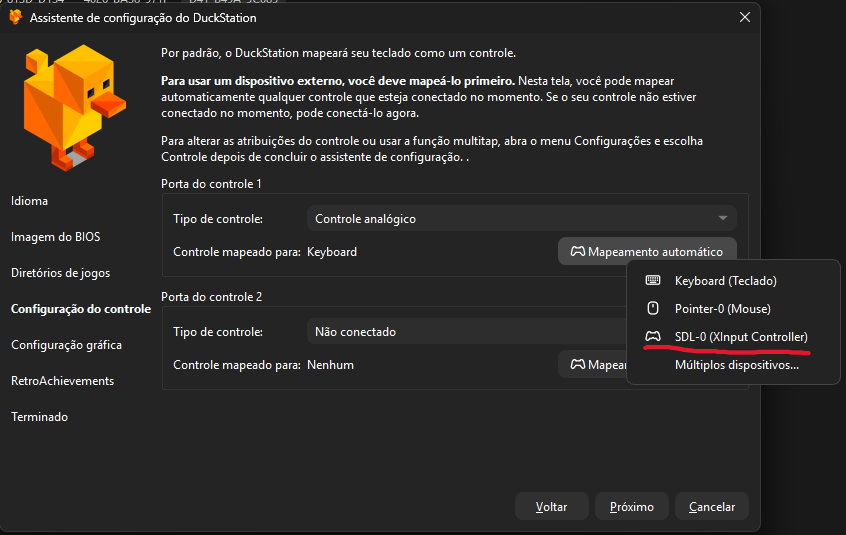
&nbsp;
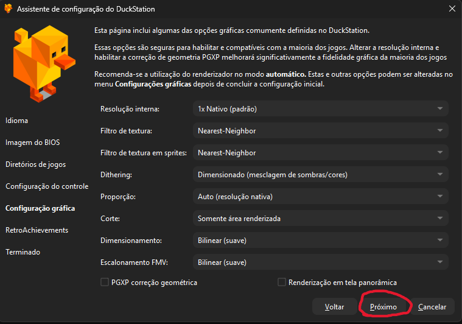
&nbsp;
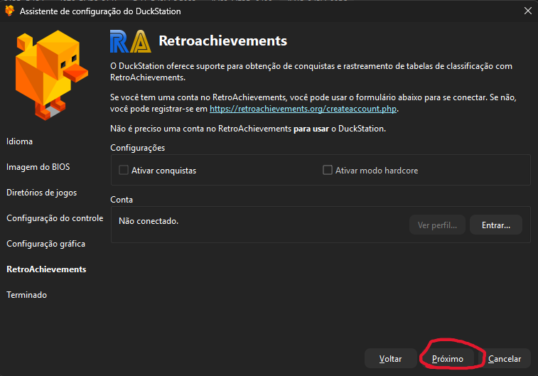
&nbsp;
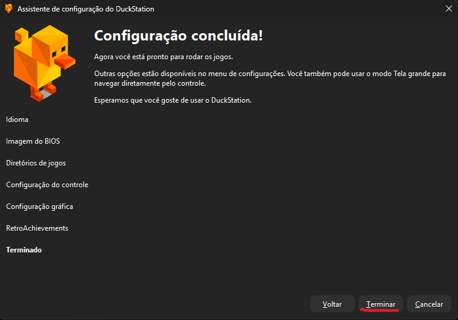

&nbsp;
&nbsp;

#### ETAPAS PARA O EMULADOR DE PS2:
&nbsp;
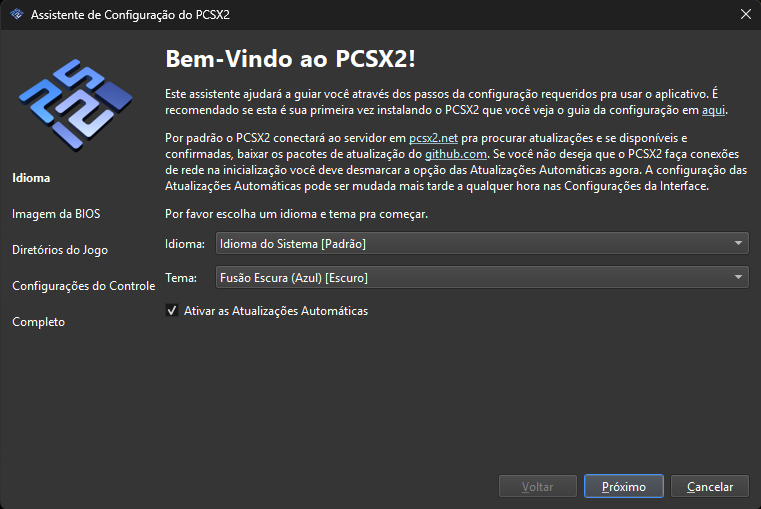
&nbsp;
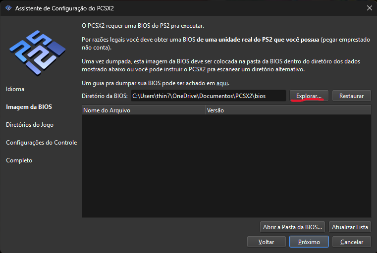
&nbsp;
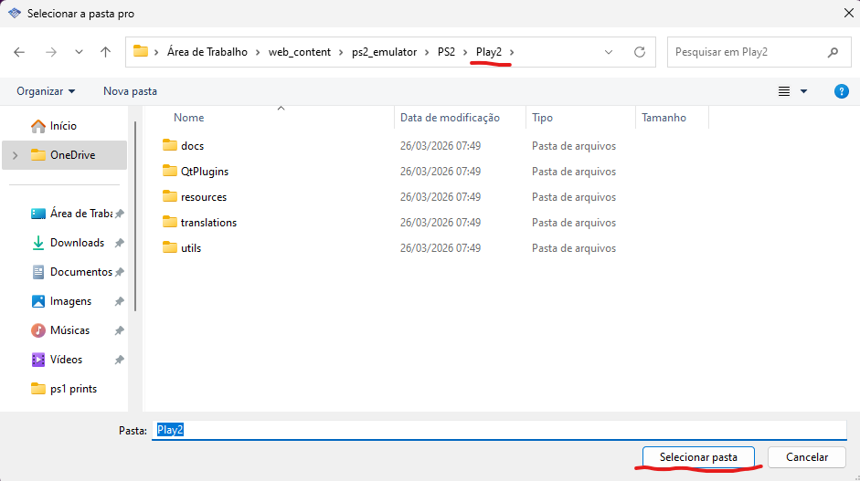
&nbsp;
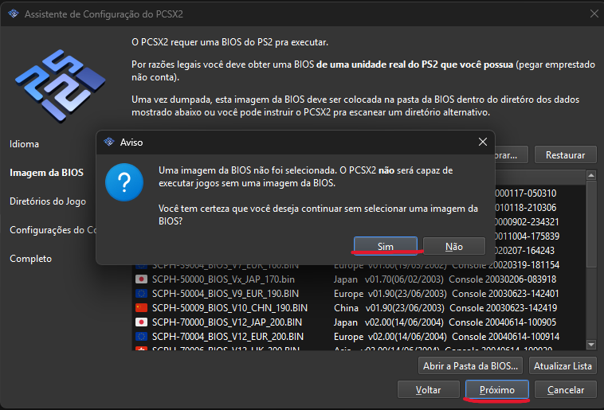
&nbsp;
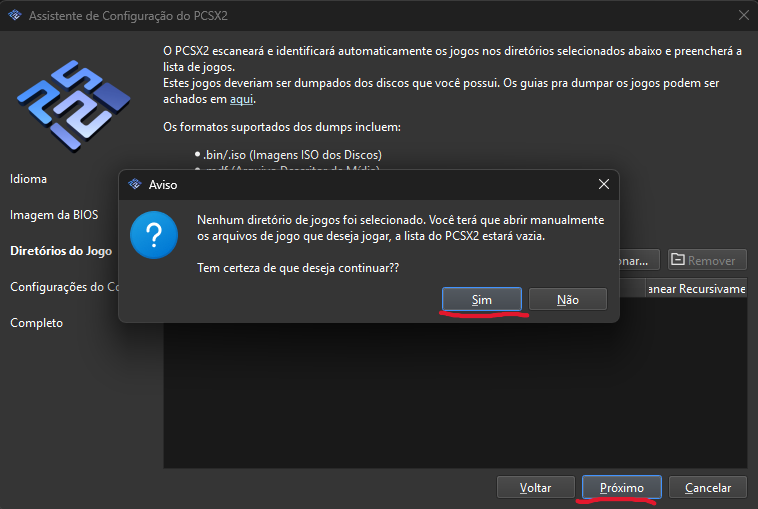
&nbsp;
### Aqui é a mesma questão do mapeamento automático.
&nbsp;
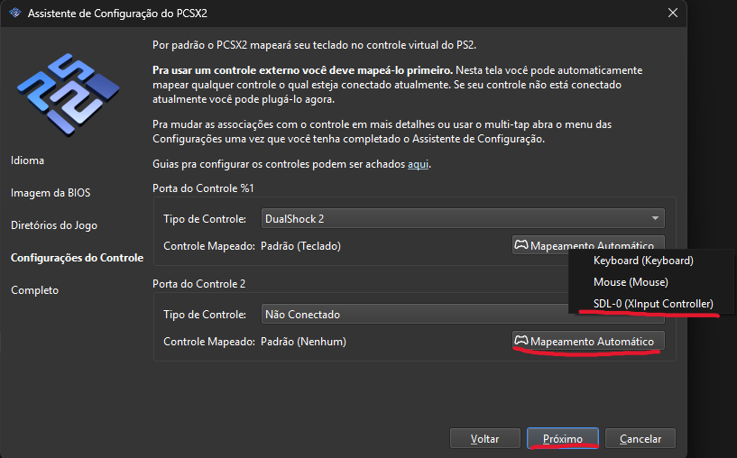
&nbsp;
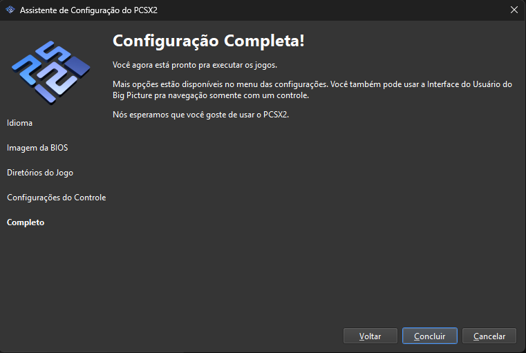

